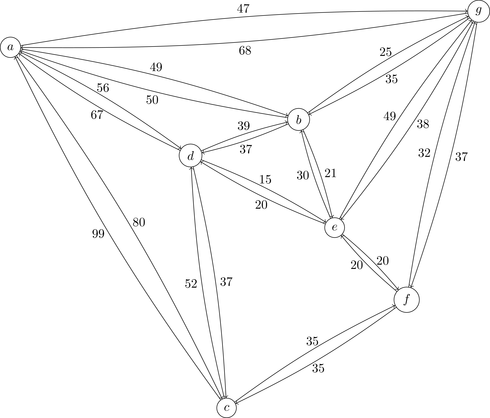
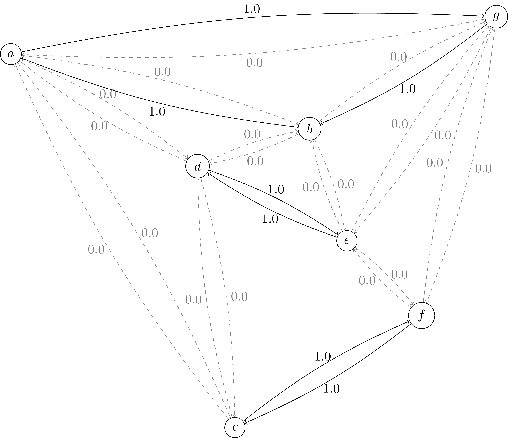
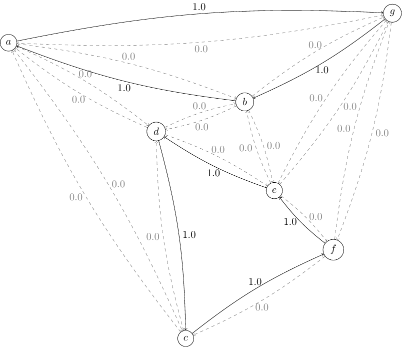

.. _chapCustom:

Developing Customized Branch-&-Cut algorithms
=============================================

This chapter discusses some features of Python-MIP that allow the development
of improved Branch-&-Cut algorithms by linking application specific routines to
the generic algorithm included in the solver engine. We start providing an
introduction to cutting planes and cut separation routines in the next section,
following with a section describing how these routines can be embedded in the
Branch-&-Cut solver engine using the generic cut callbacks of Python-MIP.

Cutting Planes
~~~~~~~~~~~~~~

In many applications there are `strong formulations <https://www.researchgate.net/publication/227062257_Strong_formulations_for_mixed_integer_programming_A_survey>`_ 
that include an exponential number of constraints. These formulations cannot be direct
handled by the MIP Solver: entering all these constraints at once is usually
not practical. In the `Cutting Planes <https://en.wikipedia.org/wiki/Cutting-plane_method>`_ 
method the LP relaxation is solved and only constraints which are *violated* are inserted. The model is re-optimized
and at each iteration a stronger formulation is obtained until no more violated
inequalities are found. The problem of discovering which are the missing
violated constraints is also an optimization problem (finding *the most* violated
inequality) and it is called the *Separation Problem*.

As an example, consider the Traveling Salesman Problem. The  compact
formulation (:numref:`tsp-label`) is a *weak* formulation: dual bounds produced
at the root node of the search tree are distant from the optimal solution cost
and improving these bounds requires a potentially intractable number of
branchings. In this case, the culprit are the sub-tour elimination constraints
involving variables :math:`x` and :math:`y`. A much stronger TSP formulation
can be written as follows: consider a graph :math:`G=(N,A)` where :math:`N` is
the set of nodes and :math:`A` is the set of directed edges with associated
traveling costs :math:`c_a \in A`. Selection of arcs is done with binary
variables :math:`x_a \,\,\, \forall a \in A`. Consider also that edges arriving
and leaving a node :math:`n` are indicated in :math:`A^+_n` and :math:`A^-_n`,
respectively. The complete formulation follows:

.. math::

  \textrm{Minimize:} &  \\
   & \sum_{a \in A} c_a\ldotp x_a \\
  \textrm{Subject to:} &  \\
   & \sum_{a \in A^+_n} x_a = 1 \,\,\, \forall n \in N \\
   & \sum_{a \in A^-_n} x_a = 1 \,\,\, \forall n \in N \\
 & \sum_{(i,j) \in A : i\in S \land j \in S} x_{(i,j)} \leq |S|-1 \,\,\, \forall
 S \subset I \\
     & x_a \in \{0,1\} \,\,\, \forall a \in A

The third constraints are sub-tour elimination constraints. Since these
constraints are stated for *every subset* of nodes, the number of these
constraints is :math:`O(2^{|N|})`. These are the constraints that will be
separated by our cutting pane algorithm. As an example, consider the following
graph:

The optimal LP relaxation of the previous formulation without the sub-tour
elimination constraints has cost 237:

As it can be seen, there are tree disconnected sub-tours. Two of these
include only two nodes. Forbidding sub-tours of size 2 is quite easy: in
this case we only need to include the additional constraints:
:math:`x_{(d,e)}+x_{(e,d)}\leq 1` and :math:`x_{(c,f)}+x_{(f,c)}\leq 1`.

Optimizing with these two additional constraints the objective value 
increases to 244 and the following new solution is generated:

Now there are sub-tours of size 3 and 4. Let's consider the sub-tour defined by
nodes :math:`S=\{a,b,g\}`. The valid inequality for :math:`S` is: 
:math:`x_{(a,g)} + x_{(g,a)} + x_{(a,b)} + x_{(b,a)} + x_{(b,g)} + x_{(g,b)} \leq 2`.
Adding this cut to our model increases the objective value to 261, s significant
improvement. In our example, the visual identification of the isolated subset is 
easy, but how to automatically identify these subsets efficiently in the general case ?
A subset is a *cut* in a Graph. To identify the most isolated subset we just have to 
solve the `Minimum cut problem in graphs <https://en.wikipedia.org/wiki/Minimum_cut>`_. 
In python you can use the `networkx min-cut module <https://networkx.github.io/documentation/networkx-1.10/reference/generated/networkx.algorithms.flow.minimum_cut.html>`_. 
The following code implements a cutting plane algorithm for the asymmetric traveling 
salesman problem:

.. code-block:: python
 :linenos:

 from mip.model import *
 from itertools import product
 from networkx import minimum_cut,DiGraph
 N =['a', 'b', 'c', 'd', 'e', 'f', 'g']
 A ={('a','d'):56,('d','a'):67,('a','b'):49,('b','a'):50,('d','b'):39,('b','d'):37,('c','f'):35,
     ('f','c'):35,('g','b'):35,('b','g'):35,('g','b'):35,('b','g'):25,('a','c'):80,('c','a'):99,
     ('e','f'):20,('f','e'):20,('g','e'):38,('e','g'):49,('g','f'):37,('f','g'):32,('b','e'):21,
     ('e','b'):30,('a','g'):47,('g','a'):68,('d','c'):37,('c','d'):52,('d','e'):15,('e','d'):20}
 Aout = {n:[a for a in A if a[0]==n] for n in N}
 Ain  = {n:[a for a in A if a[1]==n] for n in N}
 m = Model()
 x = {a:m.add_var(name='x({},{})'.format(a[0], a[1]), var_type=BINARY) for a in A}
 m.objective = xsum(c*x[a] for a,c in A.items())
 for n in N:
   m += xsum(x[a] for a in Aout[n]) == 1, 'out({})'.format(n)
   m += xsum(x[a] for a in Ain[n]) == 1, 'in({})'.format(n)
 newConstraints=True
 m.relax()
 while newConstraints:
   m.optimize()
   print('objective value : {}'.format(m.objective_value))
   G = DiGraph()
   for a in A:
     G.add_edge(a[0], a[1], capacity=x[a].x)
   newConstraints=False
   for (n1,n2) in [(i,j) for (i,j) in product(N,N) if i!=j]:
     cut_value, (S,NS) = minimum_cut(G, n1, n2)
     if (cut_value<=0.99):
       m += xsum(x[a] for a in A if (a[0] in S and a[1] in S)) <= len(S)-1
       newConstraints = True 

Lines 5-8 are the input data. Nodes are labeled with letters in a list
:code:`N` and a dictionary :code:`A` is used to store the weighted
directed graph. Lines 9 and 10 store output and input arcs per node. The
mapping of binary variables :math:`x_a` to arcs is made also using
a dictionary in line 12. Line 13 sets the objective function and the
following tree lines include constraints enforcing one entering and one
leaving arc to be selected for each node. On line 18 we relax the
integrality constraints of variables so that the optimization performed in
line 20 will only solve the LP relaxation and the separation routine can
be executed. Our separation routine is executed for each pair or nodes at
line 28 and whenever a disconnected subset is found the violated inequality
is generated and included at line 29. The process repeats while new
violated inequalities are generated.

.. _cut-generation-label:

Cut Callback 
~~~~~~~~~~~~

The cutting plane method has some limitations: even though the first rounds of
cuts improve significantly the lower bound, the overall number of iterations
needed to obtain the optimal integer solution may be too large. Better results
can be obtained with the `Branch-&-Cut algorithm <https://en.wikipedia.org/wiki/Branch_and_cut>`_, 
where cut generation is combined with branching. If you have an algorithm like
the one included in the previous Section to separate inequalities for your
application you can combine it with the complete BC algorithm implemented in
the solver engine using *callbacks*. Cut generation callbacks (CGC) are called
at each node of the search tree where a fractional solution is found. Cuts are
generated in the callback and returned to the MIP solver engine which adds
these cuts to the solver *Cut Pool*. These cuts are merged with the cuts
generated with the solver builtin cut generators and a *subset* of these cuts in
included to the LP relaxation model. Please note that in the Branch-&-Cut
algorithm context cuts are *optional* components and only those that are classified as
*good* cuts by the solver engine will be accepted, i.e., cuts that are too
dense and have a small violation and could slow down too much the LP re-optimization 
can be discarded. Thus, when using cut callbacks be sure that cuts are used only to *improve* the 
LP relaxation but not to *define* feasible solutions, which need to be defined by the initial 
formulation. In other words, the initial model
without cuts may be *weak* but needs to be *complete*. In the case of TSP, we can include the weak sub-tour 
elimination constraints presented in Section (:numref:`tsp-label`) in the initial model and then add the stronger sub-tour elimination constraints presented in the previous section as cuts. 

In Python-MIP, CGC are implemented
extending the :class:`~mip.model.CutsGenerator` class.

.. code-block:: python
 :linenos:

 from tspdata import TSPData
 from sys import argv
 from mip.model import *
 from mip.constants import *
 import networkx as nx
 from itertools import product

 class SubTourCutGenerator(CutsGenerator):
    def __init__(self, model: Model):
        super().__init__(model)

    def generate_cuts(self, relax_solution: List[Tuple[Var, float]]) -> List[LinExpr]:
        G = nx.DiGraph()
        r = [(v,f) for (v,f) in relax_solution if 'x(' in v.name]
        U = [int(v.name.split('(')[1].split(',')[0]) for v,f in r]
        V = [int(v.name.split(')')[0].split(',')[1]) for v,f in r]
        UV = {u for u in (U+V)}
        for i in range(len(U)):
            G.add_edge(U[i], V[i], capacity=r[i][1])
        cp = CutPool()
        for u in UV:
            for v in [v for v in UV if v!=u]:
                val, (S,NS) = nx.minimum_cut(G, u, v)
                if val<=0.99:
                    arcsInS = [(v,f) for i,(v,f) in enumerate(r) if U[i] in S and V[i] in S]
                    if sum(f for v,f in arcsInS) >= (len(S)-1)+1e-4:
                        cut = xsum(1.0*v for v,fm in arcsInS) <= len(S)-1
                        cp.add(cut)
        return cp.cuts

 inst = TSPData(argv[1])
 n,d = inst.n, inst.d
 model = Model()
 x = [[model.add_var(name='x({},{})'.format(i, j),
       var_type=BINARY) for j in range(n)] for i in range(n)]
 y = [model.add_var(name='y({})'.format(i), 
     lb=0.0, ub=n) for i in range(n)]
 model.objective = xsum(d[i][j] * x[i][j] for j in range(n) for i in range(n))
 for i in range(n):
     model += xsum(x[j][i] for j in range(n) if j != i) == 1, 'enter({})'.format(i)
     model += xsum(x[i][j] for j in range(n) if j != i) == 1, 'leave({})'.format(i)
 for (i,j) in [(i,j) for (i,j) in product(range(1,n), range(1,n)) if i!=j]:
         model += y[i] - (n + 1) * x[i][j] >= y[j] - n, 'noSub({},{})'.format(i, j)
 model.add_cut_generator(SubTourCutGenerator(model))
 model.optimize()
 arcs = [(i,j) for i in range(n) for j in range(n) if x[i][j].x >= 0.99]
 print('optimal route : {}'.format(arcs))

.. _mipstart-label:

Providing initial feasible solutions
~~~~~~~~~~~~~~~~~~~~~~~~~~~~~~~~~~~~

The Branch-&-Cut algorithm usually executes faster with the availability of an integer feasible solution: an upper bound for the solution cost improves its ability of pruning branches in the search tree and this solution is also used in local search MIP heuristics. MIP solvers employ several heuristics for the automatically production of these solutions but they do not always succeed. 

If you have some problem specific heuristic which can produce an initial feasible solution for your application then you can inform this solution to the MIP solver using the :attr:`~mip.model.Model.start` model property. Let's consider our TSP application (:numref:`tsp-label`). If the graph is complete, i.e. distances are available for each pair of cities, then *any* permutation :math:`\Pi=(\pi_1,\ldots,\pi_n)` of the cities :math:`N` can be used as an initial feasible solution. This solution has exactly :math:`|N|` :math:`x` variables equal to one indicating the selected arcs: :math:`((\pi_1,\pi_2), (\pi_2,\pi_3), \ldots, (\pi_{n-1},\pi_{n}), (\pi_{n},\pi_{1}))`. Even though this solution is obvious for the modeler, which knows that binary variables of this model refer to arcs in a TSP graph, this solution is not obvious for the MIP solver, which only sees variables and a constraint matrix. The following example enters an initial random permutation of cities as initial feasible solution for our TSP example, considering an instance with :code:`n` cities, and a model :code:`model` with references to variables stored in a matrix :code:`x[0,...,n][0,..,n]`:

.. code-block:: python
    :linenos:
    
    from random import shuffle
    S=[i for i in range(n)]
    shuffle(S)
    model.start = [(x[S[k-1]][S[k]], 1.0) for k in range(n)]

The previous example can be integrated in our TSP example (:numref:`tsp-label`) by inserting these lines before the :code:`model.optimize()` call. Initial feasible solutions are informed in a list (line 4) of :code:`(var, value)` pairs. Please note that only the original non-zero problem variables need to be informed, i.e., the solver will automatically compute the values of the auxiliary :math:`y` variables which are used only to eliminate sub-tours.
