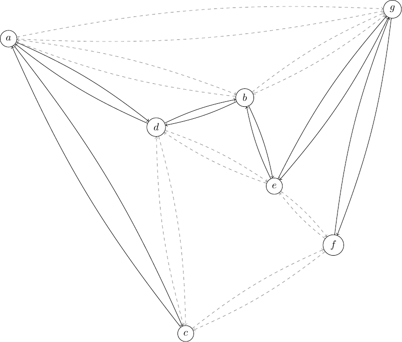

.. _chapCustom:

Developing Customized Branch-&-Cut algorithms
=============================================

This chapter discusses some features of Python-MIP that allow the development
of improved Branch-&-Cut algorithms by linking application specific routines to
the generic algorithm included in the solver engine. We start providing an
introduction to cutting planes and cut separation routines in the next section,
following with a section describing how these routines can be embedded in the
Branch-&-Cut solver engine using the generic cut callbacks of Python-MIP.

Cutting Planes
~~~~~~~~~~~~~~

In many applications there are strong formulations that require an
exponential number of constraints. These formulations cannot be direct
handled by the MIP Solver: entering all these constraints at once is usually
not practical. In the *Cutting Planes* method the LP relaxation is solved and
only constraints which are *violated* are inserted. The model is re-optimized
and at each iteration a stronger formulation is obtained until no more violated
inequalities are found. The problem of discovering which are the missing
violated constraints is also an optimization problem (finding the most violated
inequality) and it is called the *Separation Problem*.

As an example, consider the Traveling Salesman Problem. The  compact
formulation (:numref:`tsp-label`) is a *weak* formulation: dual bounds produced
at the root node of the search tree are distant from the optimal solution cost
and improving these bounds requires a potentially intractable number of
branchings. In this case, the culprit are the subtour elimination constraints
involving variables :math:`x` and :math:`y`. A much stronger TSP formulation
can be written as follows: consider a graph :math:`G=(N,A)` where :math:`N` is
the set of nodes and :math:`A` is the set of directed edges with associated
traveling costs :math:`c_a \in A`. Selection of arcs is done with binary
variables :math:`x_a \,\,\, \forall a \in A`. Consider also that edges arriving
and leaving a node :math:`n` are indicated in :math:`A^+_n` and :math:`A^-_n`,
respectively. The complete formulation follows:

.. math::

  \textrm{Minimize:} &  \\
   & \sum_{a \in A} c_a\ldotp x_a \\
  \textrm{Subject to:} &  \\
   & \sum_{a \in A^+_n} x_a = 1 \,\,\, \forall n \in N \\
   & \sum_{a \in A^-_n} x_a = 1 \,\,\, \forall n \in N \\
 & \sum_{i\in S}\sum_{j \in I\setminus S} x_{i,j} + \sum_{i\in I\setminus S}\sum_{j \in S} x_{i,j} \geq 2 \,\,\, \forall
 S \subset I \\
     & x_a \in \{0,1\} \,\,\, \forall a \in A

The third constraints are sub-tour elimination constraints. Since these
constraints are stated for *every subset* of nodes, the number of these
constraints is :math:`O(2^{|N|})`. These are the constraints that will be
separated by our cutting pane algorithm. As an example, consider the following
graph:

.. image:: ./images/tspG.png
    :width: 45%
    :align: center

The optimal LP relaxation of the previous formulation without the sub-tour
elimination constraints has cost 237:

.. image:: ./images/tspRoot.png
    :width: 45%
    :align: center

As it can be seen, there are tree disconnected sub-tours. Two of these
include only two nodes. Forbidding sub-tours of size 2 is quite easy: in
this case we only need to include the additional constraints:
:math:`x_{(d,e)}+x_{(e,d)}\leq 1` and :math:`x_{(c,f)}+x_{(f,c)}\leq 1`.

Optimizing with these two additional constraints the objective value 
increases to 244 and the following new solution is generated:

.. image:: ./images/tspNo2Sub.png
    :width: 45%
    :align: center

Now there are sub-tours of size 3 and 4. Let's consider the sub-tour defined by
nodes :math:`S=\{a,b,g\}`. To eliminate this sub-tour we need to include a
constraint stating that elements *in* :math:`S` should have two arcs linking
with elements *outside* :math:`S` (:math:`N\setminus S`), one for entering this
subset and another for leaving.  Arcs connecting :math:`S` to the remaining
nodes are shown bellow:

Our cut, in this case, would be :math:`x_{(a,d)} + x_{(d,a)} + x_{(d,b)} + x_{(b,d)} + x_{(a,c)} + x_{(c,a)} + x_{(g,e)} + x_{(e,g)} + x_{(g,f)} + x_{(f,g)} + x_{(b,e)} + x_{(e,b)} \geq 2`. 
Adding it to our model increases the objective value to 261, s significant
improvement. In our example, the visual identification of the isolated subset is 
easy, but how to automatically identify these subsets efficiently in the general case ?
A subset is a *cut* in a Graph. To identify the most isolated subset we just have to 
solve the `Minimum cut problem in graphs <https://en.wikipedia.org/wiki/Minimum_cut>`_. 
In python you can use the `networkx min-cut module <https://networkx.github.io/documentation/networkx-1.10/reference/generated/networkx.algorithms.flow.minimum_cut.html>`_. 
The following code implements a cutting plane algorithm for the assimetric traveling 
salesman problem:

.. code-block:: python
 :linenos:

 from mip.model import *
 from itertools import product
 from networkx import minimum_cut,DiGraph
 N =['a', 'b', 'c', 'd', 'e', 'f', 'g']
 A ={('a','d'):56,('d','a'):67,('a','b'):49,('b','a'):50,('d','b'):39,('b','d'):37,('c','f'):35,
     ('f','c'):35,('g','b'):35,('b','g'):35,('g','b'):35,('b','g'):25,('a','c'):80,('c','a'):99,
     ('e','f'):20,('f','e'):20,('g','e'):38,('e','g'):49,('g','f'):37,('f','g'):32,('b','e'):21,
     ('e','b'):30,('a','g'):47,('g','a'):68,('d','c'):37,('c','d'):52,('d','e'):15,('e','d'):20}
 Aout = {n:[a for a in A if a[0]==n] for n in N}
 Ain  = {n:[a for a in A if a[1]==n] for n in N}
 m = Model()
 x = {a:m.add_var(name='x({},{})'.format(a[0], a[1]), var_type=BINARY) for a in A}
 m.objective = xsum(c*x[a] for a,c in A.items())
 for n in N:
   m += xsum(x[a] for a in Aout[n]) == 1, 'out({})'.format(n)
   m += xsum(x[a] for a in Ain[n]) == 1, 'in({})'.format(n)
 newConstraints=True
 m.relax()
 while newConstraints:
   m.optimize()
   print('objective value : {}'.format(m.objective_value))
   G = DiGraph()
   for a in A:
     G.add_edge(a[0], a[1], capacity=x[a].x)
   newConstraints=False
   for (n1,n2) in [(i,j) for (i,j) in product(N,N) if i!=j]:
     cut_value, (S,NS) = minimum_cut(G, n1, n2)
     if (cut_value<=0.99):
       m += xsum(x[a] for a in A if (a[0] in S and a[1] in NS)or(a[1] in S and a[0] in NS))>=2
       newConstraints = True 

Lines 5-8 are the input data. Nodes are labeled with letters in a list
:code:`N` and a dictionary :code:`A` is used to store the weighted
directed graph. Lines 9 and 10 store output and input arcs per node. The
mapping of binary variables :math:`x_a` to arcs is made also using
a dictionary in line 12. Line 13 sets the objective function and the
following tree lines include constraints enforcing one entering and one
leaving arc to be selected for each node. On line 18 we relax the
integrality constraints of variables so that the optimization performed in
line 20 will only solve the LP relaxation and the separation routine can
be executed. Our separation routine is executed for each pair or nodes at
line 28 and whenever two disconnected nodes are found the partition of the
graph in the sets :math:`S \subset N` and :math:`N \setminus S` generates
the violated inequality added ad line 31. The process repeats while new
violated inequalities are generated.

Cut Callback 
~~~~~~~~~~~~

The cutting plane method has some limitations: even though the first rounds of
cuts improve significantly the lower bound, the overall number of iterations
needed to obtain the optimal integer solution may be too large. Better results
can be obtained with the Branch-&-Cut algorithm, where cut generation is
combined with branching. If you have an algorithm like the one included in the
previous Section to separate inequalities for your application you can combine
it with the complete BC algorithm implemented in the solver engine using
callbacks. Cut generation callbacks (CGC) are called at each node of the search
tree where a fractional solution is found. In Python-MIP, CGC are implemented
extending the CutsGenerator class.
