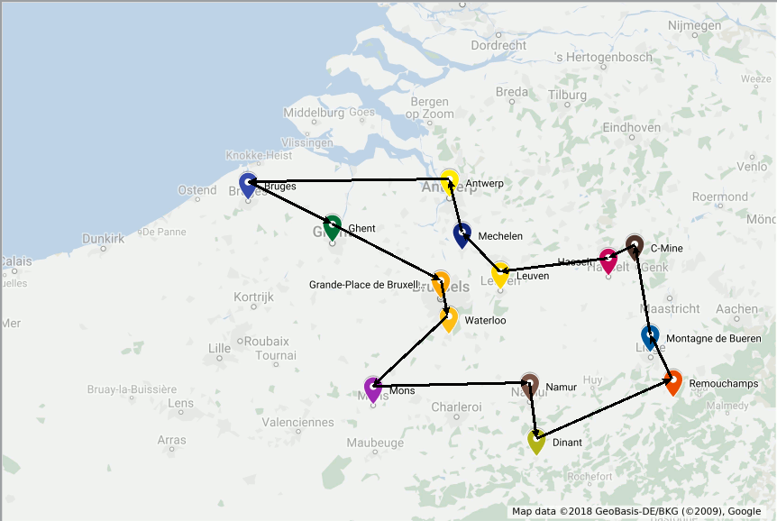

.. _chapExamples:

Modeling Examples
=================

This chapter includes commented examples on modeling and solving optimization
problems with Python-MIP.

The 0/1 Knapsack Problem
------------------------

As a first example, consider the solution of the 0/1 knapsack problem:
given a set :math:`I` of items, each one with a weight :math:`w_i`  and
estimated profit :math:`p_i`, one wants to select a subset with maximum
profit such that the summation of the weights of the selected items is
less or equal to the knapsack capacity :math:`c`.
Considering a set of decision binary variables :math:`x_i` that receive
value 1 if the :math:`i`-th item is selected, or 0 if not, the resulting
mathematical programming formulation is:

.. math::

    \textrm{Maximize: }   &  \\
                                   &  \sum_{i \in I} p_i \cdot x_i  \\
    \textrm{Subject to: } & \\
                                   &  \sum_{i \in I} w_i \cdot x_i \leq c  \\
                                   &  x_i \in \{0,1\} \,\,\, \forall i \in I

The following python code creates, optimizes and prints the optimal solution for the
0/1 knapsack problem

.. literalinclude:: ../examples/knapsack.py
    :caption: Solves the 0/1 knapsack problem: knapsack.py
    :linenos:
    :lines: 3-21

Line 1 imports the required classes and definitions from Python-MIP. Lines 3-5 define the problem data. Line 7 creates an empty maximization
problem :code:`m` with the (optional) name of "knapsack". Line 9 adds the binary decision variables to model :code:`m` and stores their references in a list :code:`x`. Line 11 defines the objective function of this model and line 13 adds the capacity constraint. The model is optimized in line 15 and the solution, a list of the selected
items, is computed at line 17.

.. _tsp-label:

The Traveling Salesman Problem
------------------------------

The traveling salesman problem (TSP) is one of the most studied combinatorial
optimization problems, with the first computational studies dating back to
the 50s [Dantz54]_, [Appleg06]_.  To to illustrate this problem, consider
that you will spend some time in Belgium and wish to visit some of its
main tourist attractions, depicted in the map bellow:

You want to find the shortest possible tour to visit all these places. More
formally, considering  :math:`n` points :math:`V=\{0,\ldots,n-1\}` and
a distance matrix :math:`D_{n \times n}` with elements :math:`c_{i,j} \in
\mathbb{R}^+`, a solution consists in a set of exactly :math:`n` (origin,
destination) pairs indicating the itinerary of your trip, resulting in
the following formulation:

.. math::

    \textrm{Minimize: }   &  \\
    &  \sum_{i \in I, j \in I} c_{i,j} \ldotp x_{i,j} \\
    \textrm{Subject to: }   &  \\
    & \sum_{j \in V \setminus \{i\}} x_{i,j} = 1 \,\,\, \forall i \in V  \\
    & \sum_{i \in V \setminus \{j\}} x_{i,j} = 1 \,\,\, \forall j \in V \\
    & y_{i} -(n+1)\ldotp x_{i,j} \geq y_{j} -n  \,\,\, \forall i \in V\setminus \{0\}, j \in V\setminus \{0,i\}\\
    & x_{i,j} \in \{0,1\} \,\,\, \forall i \in V, j \in V \\
    & y_i \geq 0 \,\,\, \forall i \in V

The first two sets of constraints enforce that we leave and arrive only
once at each point. The optimal solution for the problem including only
these constraints could result in a solution with sub-tours, such as the
one bellow.

.. image:: images/belgium-tourism-14-subtour.png
    :width: 60%
    :align: center

To enforce the production of connected routes, additional variables :math:`y_{i} \geq 0` are included in the model indicating the sequential order of each point in the produced route. Point zero is arbitrarily selected as the initial point and conditional constraints
linking variables :math:`x_{i,j}`, :math:`y_{i}` and :math:`y_{j}` are created for all nodes except the the initial one to ensure that the selection of the arc :math:`x_{i,j}` implies that :math:`y_{j}\geq y_{i}+1`.

The Python code to create, optimize and print the optimal route for the TSP is
included bellow:

.. literalinclude:: ../examples/tsp-compact.py
    :caption: Traveling salesman problem solver with compact formulation: tsp-compact.py
    :linenos:
    :lines: 6-79

In line 10 names of the places to visit are informed. In line 17 distances are informed in an upper triangular matrix. Line 33 stores the number of nodes and a list with nodes sequential ids starting from 0. In line 36 a full :math:`n \times n` distance matrix is filled. Line 41 creates an empty MIP model. In line 44 all binary decision variables for the selection of arcs are created and their references are stored a :math:`n \times n` matrix named :code:`x`. Differently from the :math:`x` variables, :math:`y` variables (line 48) are not required to be
binary or integral, they can be declared just as continuous variables, the default variable type. In this case, the parameter :code:`var_type` can be omitted from the :code:`add_var` call.

Line 51 sets the total traveled distance as objective function and lines 54-62 include the constraints. In line 66 we call the optimizer specifying a time limit of 30 seconds. This
will surely not be necessary for our Belgium example, which will be solved instantly, but may be important for larger problems: even though high quality solutions may be found very quickly by the MIP solver, the time required to *prove* that the current solution is optimal may be very
large. With a time limit, the search is truncated and the best solution found during the search is reported. In line 69 we check for the availability of a feasible solution. To repeatedly check for the next node in the route we check for the solution value (:code:`.x` attribute) of all variables of outgoing arcs of the current node in the route (line 73). The optimal solution for our trip has length 547 and is depicted bellow:

n-Queens
--------

In the :math:`n`-queens puzzle :math:`n` chess queens should to be placed in a
board with :math:`n\times n` cells in a way that no queen can attack another,
i.e., there must be at most one queen per row, column and diagonal. This is a
constraint satisfaction problem: any feasible solution is acceptable and no
objective function is defined. The following binary programming formulation
can be used to solve this problem:

.. math::

    \sum_{j=1}^{n} x_{ij} & = 1 \,\,\, \forall i \in \{1, \ldots, n\}  \\
    \sum_{i=1}^{n} x_{ij} & = 1 \,\,\, \forall j \in \{1, \ldots, n\}  \\
    \sum_{i=1}^n \sum_{j=1 : i-j=k}^{n} x_{i,j} & \leq 1 \,\,\, \forall i \in \{1, \ldots, n\} ,  k \in \{2-n, \ldots, n-2\}  \\
    \sum_{i=1}^n \sum_{j=1 : i+j=k}^{n} x_{i,j} & \leq 1 \,\,\, \forall i \in \{1, \ldots, n\} ,  k \in \{3, \ldots, n+n-1\}  \\
    x_{i,j} & \in \{0, 1\} \,\,\, \forall i\in \{1, \ldots, n\}, j\in \{1, \ldots, n\}

The following code builds the previous model, solves it and prints the queen placements:

.. literalinclude:: ../examples/queens.py
    :caption: Solver for the n-queens problem: queens.py
    :linenos:
    :lines: 5-41

Frequency Assignment
--------------------

The design of wireless networks, such as cell phone networks, involves
assigning communication frequencies to devices. These communication frequencies
can be separated into channels. The geographical area covered by a network can
be divided into hexagonal cells, where each cell has a base station that covers
a given area. Each cell requires a different number of channels, based on usage
statistics and each cell has a set of neighbor cells, based on the geographical
distances. The design of an efficient mobile network involves selecting subsets
of channels for each cell, avoiding interference between calls in the same cell
and in neighboring cells.  Also, for economical reasons, the total bandwidth in
use must be minimized, i.e., the total number of different channels used. One
of the first real cases discussed in literature are the Philadelphia
[Ande73]_ instances, with the structure depicted bellow:

.. image:: ./images/bmcpsmall.*
    :width: 40%
    :align: center

Each cell has a demand with the required number of channels drawn at the
center of the hexagon, and a sequential id at the top left corner. Also,
in this example, each cell has a set of at most 6 adjacent neighboring
cells (distance 1). The largest demand (8) occurs on cell 2. This cell has
the following adjacent cells, with distance 1: (1, 6). The minimum distances between channels in the same cell in this example is 3 and channels in neighbor cells should differ by at least 2 units.

A generalization of this problem (not restricted to the hexagonal topology), is
the Bandwidth Multicoloring Problem (BMCP), which has the following input data:

:math:`N`:
    set of cells, numbered from 1 to :math:`n`;

:math:`r_i \in \mathbb{Z}^+`:
    demand of cell :math:`i \in N`, i.e., the required number of channels;

:math:`d_{i,j} \in \mathbb{Z}^+`:
    minimum distance between channels assigned to nodes :math:`i` and :math:`j`,
    :math:`d_{i,i}` indicates the minimum distance between different channels
    allocated to the same cell.

Given an upper limit :math:`\overline{u}` on the maximum number of channels
:math:`U=\{1,\ldots,\overline{u}\}` used, which can be obtained using a simple
greedy heuristic, the BMPC can be formally stated as the combinatorial
optimization problem of defining subsets of channels :math:`C_1, \ldots, C_n`
while minimizing the used bandwidth and avoiding interference:

.. math::

     \textrm{Minimize:} & \\
                       & \max_{c \in C_1 \cup C_2, \ldots, C_n}c  \\
     \textrm{Subject to:} & \\
            \mid c_1 - c_2 \mid & \geq d_{i,j} \,\,\, \forall (i,j) \in N \times N, (c_1, c_2) \in C_i \times C_j \\
             C_i & \subseteq U \,\,\, \forall i \in N \\
             \mid C_i \mid &  = r_i \,\,\, \forall i \in N

This problem can be formulated as a mixed integer program with binary
variables indicating the composition of the subsets: binary variables
:math:`x_{(i,c)}` indicate if for a given cell :math:`i` channel :math:`c`
is selected (:math:`x_{(i,c)}=1`) or not (:math:`x_{(i,c)}=0`). The BMCP can
be modeled with the following MIP formulation:

.. math::

   \textrm{Minimize:} & \\
                      & z \\
   \textrm{Subject to:} & \\
        \sum_{c=1}^{\overline{u}} x_{(i,c)}  & = r_{i} \,\,\, \forall \, i \in N  \\
         z & \geq c\cdot x_{(i,c)} \,\,\, \forall \, i \in N, c \in U \\
        x_{(i,c)} + x_{(j,c')}   & \leq 1 \,\,\, \forall \, (i,j,c,c') \in N \times N \times U \times U : \, i \neq j \land \mid c-c' \mid < d_{(i,j)} \\
        x_{(i,c} + x_{(i,c')} & \leq 1 \,\,\, \forall i,c \in N \times U, c' \in \{c,+1\ldots, \min(c+d_{i,i}, \overline{u}) \} \\
         x_{(i,c)} & \in \{0, 1\} \,\,\, \forall \, i \in N, c \in U \\
          z  \geq 0

Follows the example of a solver for the BMCP using the previous MIP formulation:

.. literalinclude:: ../examples/bmcp.py
    :caption: Solver for the bandwidth multi coloring problem: bmcp.py
    :linenos:
    :lines: 5-55

Resource Constrained Project Scheduling
---------------------------------------

The Resource-Constrained Project Scheduling Problem (RCPSP) is a combinatorial
optimization problem that consists of finding a feasible scheduling for a set of
:math:`n` jobs subject to resource and precedence constraints. Each job has a
processing time, a set of successors jobs and a required amount of different
resources. Resources may be scarce but are renewable at each time period.
Precedence constraints between jobs mean that no jobs may start before all its
predecessors are completed. The jobs must be scheduled non-preemptively, i.e.,
once started, their processing cannot be interrupted.

The RCPSP has the following input data:

:math:`\mathcal{J}`
    jobs set

:math:`\mathcal{R}`
    renewable resources set

:math:`\mathcal{S}`
    set of precedences between jobs :math:`(i,j) \in \mathcal{J} \times \mathcal{J}`

:math:`\mathcal{T}`
    planning horizon: set of possible processing times for jobs

:math:`p_{j}`
    processing time of job :math:`j`

:math:`u_{(j,r)}`
    amount of resource :math:`r` required for processing job :math:`j`

:math:`c_r`
    capacity of renewable resource :math:`r`

In addition to the jobs that belong to the project, the set :math:`\mathcal{J}`
contains jobs :math:`0` and :math:`n+1`, which are dummy jobs that
represent the beginning and the end of the planning, respectively. The
processing time for the dummy jobs is always zero and these jobs do not consume
resources.

A binary programming formulation was proposed by Pritsker et al. [PWW69]_.
In this formulation, decision variables :math:`x_{jt} = 1` if job
:math:`j` is assigned to begin at time :math:`t`; otherwise, :math:`x_{jt} = 0`.
All jobs must finish in a single instant of time without violating precedence constraints
while respecting the amount of available resources.
The model proposed by Pristker can be stated as follows:

.. math::

     \textrm{Minimize} & \\
     &  \sum_{t\in \mathcal{T}} t\cdot x_{(n+1,t)}\\
     \textrm{Subject to:} & \\
      \sum_{t\in \mathcal{T}} x_{(j,t)} & = 1  \,\,\, \forall j\in J\\
      \sum_{j\in J} \sum_{t_2=t-p_{j}+1}^{t} u_{(j,r)}x_{(j,t_2)} & \leq c_{r}  \,\,\, \forall t\in \mathcal{T}, r \in R\\
      \sum_{t\in \mathcal{T}} t\cdot x_{(s,t)} - \sum_{t \in \mathcal{T}} t\cdot x_{(j,t)} & \geq p_{j}  \,\,\, \forall (j,s) \in S\\
     x_{(j,t)} & \in \{0,1\} \,\,\, \forall j\in J, t \in \mathcal{T}

An instance is shown below. The figure shows a graph where jobs in :math:`\mathcal{J}`
are represented by nodes and precedence relations :math:`\mathcal{S}` are represented
by directed edges. The time-consumption :math:`p_{j}` and all
information concerning resource consumption :math:`u_{(j,r)}` are included next to the
graph. This instance contains 10 jobs and 2 renewable resources,
:math:`\mathcal{R}=\{r_{1}, r_{2}\}`, where :math:`c_{1}` = 6 and :math:`c_{2}` = 8.
Finally, a valid (but weak) upper bound on the time horizon :math:`\mathcal{T}`
can be estimated by summing the duration of all jobs.

The Python code for creating the binary programming model, optimize it and print the optimal scheduling
for RCPSP is included below:

.. literalinclude:: ../examples/rcpsp.py
    :caption: Solves the Resource Constrained Project Scheduling Problem: rcpsp.py
    :linenos:
    :lines: 3-43

One optimum solution is shown bellow, from the viewpoint of resource consumption.

.. image:: ./images/rcpsp-opt.*
    :width: 80%
    :align: center

It is noteworthy that this particular problem instance has multiple optimal solutions.
Keep in the mind that the solver may obtain a different optimum solution.

Job Shop Scheduling Problem
---------------------------

The Job Shop Scheduling Problem (JSSP) is an NP-hard problem defined by a set
of jobs that must be executed by a set of machines in a specific order for each
job. Each job has a defined execution time for each machine and a defined
processing order of machines. Also, each job must use each machine only once.
The machines can only execute a job at a time and once started, the machine
cannot be interrupted until the completion of the assigned job. The objective
is to minimize the makespan, i.e. the maximum completion time among all jobs.

For instance, suppose we have 3 machines and 3 jobs. The processing order for
each job is as follows (the processing time of each job in each machine is
between parenthesis):

- Job :math:`j_1`: :math:`m_3` (2) :math:`\rightarrow` :math:`m_1` (1) :math:`\rightarrow` :math:`m_2` (2)
- Job :math:`j_2`: :math:`m_2` (1) :math:`\rightarrow` :math:`m_3` (2) :math:`\rightarrow` :math:`m_1` (2)
- Job :math:`j_3`: :math:`m_3` (1) :math:`\rightarrow` :math:`m_2` (2) :math:`\rightarrow` :math:`m_1` (1)

Bellow there are two feasible schedules:

.. image:: ./images/jssp1.*
    :width: 80%
    :align: center

.. image:: ./images/jssp2.*
    :width: 80%
    :align: center

The first schedule shows a naive solution: jobs are processed in a sequence and
machines stay idle quite often. The second solution is the optimal one, where jobs
execute in parallel.

The JSSP has the following input data:

:math:`\mathcal{J}`
    set of jobs, :math:`\mathcal{J} = \{1,...,n\}`,

:math:`\mathcal{M}`
    set of machines, :math:`\mathcal{M} = \{1,...,m\}`,

:math:`o^j_r`
    the machine that processes the :math:`r`-th operation of job :math:`j`, the sequence
    without repetition :math:`O^j = (o^j_1,o^j_2,...,o^j_m)` is the processing order of :math:`j`,

:math:`p_{ij}`
    non-negative integer processing time of job :math:`j` in machine :math:`i`.

A JSSP solution must respect the following constraints:

- All jobs :math:`j` must be executed following the sequence of machines given by :math:`O^j`,
- Each machine can process only one job at a time,
- Once a machine starts a job, it must be completed without interruptions.

The objective is to minimize the makespan, the end of the last job to be
executed. The JSSP is NP-hard for any fixed :math:`n \ge 3` and also for any
fixed :math:`m \ge 3`.

The decision variables are defined by:

:math:`x_{ij}`
    starting time of job :math:`j \in J` on machine :math:`i \in M`

:math:`y_{ijk}=`
    :math:`\begin{cases} 1, & \text{if job } j \text{ precedes job } k \text{ on machine } i \text{,}\\ & i \in \mathcal{M} \text{, } j, k  \in \mathcal{J} \text{, } j \neq k \\ 0, & \text{otherwise} \end{cases}`

:math:`C`
    variable for the makespan

Follows a MIP formulation [Mann60]_ for the JSSP. The objective function
is computed in the auxiliary variable :math:`C`. The first set of
constraints are the precedence constraints, that ensure that a job on
a machine only starts after the processing of the previous machine
concluded. The second and third set of disjunctive constraints ensure that
only one job is processing at a given time in a given machine. The
:math:`M` constant must be large enough to ensure the correctness of these
constraints. A valid (but weak) estimate for this value can be the
summation of all processing times. The fourth set of constrains ensure
that the makespan value is computed correctly and the last constraints
indicate variable domains.

.. math::

    \textrm{min: }  &  \\
                   & C \\
    \textrm{s.t.: } &  \\
                   x_{o^{j}_{r}j} &  \geq x_{o^{j}_{r-1}j} +p_{o^{j}_{r-1}j} \,\,\, \forall r \in \{2,..,m\}, j \in \mathcal{J} \\
                       x_{ij}     & \geq x_{ik} + p_{ik} - M \cdot y_{ijk} \,\,\, \forall j,k \in \mathcal{J}, j \neq k, i \in \mathcal{M} \\
                       x_{ik}     & \geq x_{ij} + p_{ij} - M \cdot (1-y_{ijk}) \,\,\, \forall j,k \in \mathcal{J}, j \neq k,i \in \mathcal{M} \\
                       C          & \geq x_{o^{j}_{m}j} + p_{o^{j}_{m}j} \,\,\, \forall j \in \mathcal{J} \\
                      x_{ij}      & \geq 0 \,\,\, \forall i \in \mathcal{J}, i \in \mathcal{M} \\
                      y_{ijk}     & \in \{0,1\} \,\,\, \forall j,k \in \mathcal{J}, i \in \mathcal{M} \\
                      C & \geq 0

The following Python-MIP code creates the previous formulation, optimizes it and prints
the optimal solution found:

.. literalinclude:: ../examples/jssp.py
    :caption: Solves the Job Shop Scheduling Problem (examples/jssp.py)
    :linenos:
    :lines: 6-48

Cutting Stock / One-dimensional Bin Packing Problem
---------------------------------------------------

The One-dimensional Cutting Stock Problem (also often referred to as
One-dimensional Bin Packing Problem) is an NP-hard problem first studied
by Kantorovich in 1939 [Kan60]_. The problem consists of deciding how to
cut a set of pieces out of a set of stock materials (paper rolls, metals,
etc.) in a way that minimizes the number of stock materials used.

[Kan60]_ proposed an integer programming formulation for the problem,
given below:

.. math::
    \textrm{min:}
        & \sum_{j=1}^{n} y_{j}  \\
    \textrm{s.t.:}
        & \sum_{j=1}^{n} x_{i,j}      \geq b_{i}   \;\; \forall i \in \{ 1 \ldots m \} \\
        & \sum_{i=1}^{m} w_{i}x_{i,j} \leq L y_{j} \;\; \forall j \in \{ 1 \ldots n \} \\
        & y_{j} \in \{0,1\}                        \;\; \forall j\in \{1 \ldots n\} \\
        & x_{i,j} \in \mathbb{Z}^+                 \;\; \forall i\in \{1 \ldots m\}, \forall j\in \{1 \ldots n\}

This formulation can be improved by including symmetry reducing constraints, such as:

.. math::
        y_{j-1} \geq y_{j}  \;\; \forall j \in \{ 2 \ldots n \} \\

The following Python-MIP code creates the formulation proposed by
[Kan60]_, optimizes it and prints the optimal solution found.

.. literalinclude:: ../examples/cuttingstock_kantorovich.py
    :caption: Formulation for the One-dimensional Cutting Stock Problem (examples/cuttingstock_kantorovich.py)
    :linenos:
    :lines: 4-39

Note in the code above that argument :code:`obj` was employed to create the variables (see lines 11 and 13). By setting :code:`obj` to a value different than zero, the created variable is automatically added to the objective function with coefficient equal to :code:`obj`'s value.

Two-Dimensional Level Packing
-----------------------------

In some industries, raw material must be cut in several pieces of specified size. Here we consider the case where these pieces are *rectangular* [LMM02]_. Also, due to machine operation constraints, pieces should be grouped horizontally such that firstly, horizontal layers are cut with the height of the largest item in the group and secondly, these horizontal layers are then cut according to items widths. Raw material is provided in rolls with large height. To minimize waste, a given batch of items must be cut using the minimum possible total height.

Formally, the following input data defines an instance of the Two Dimensional Level Packing Problem (TDLPP):

:math:`W`
  raw material width

:math:`n`
  number of items

:math:`I`
  set of items = :math:`\{0, \ldots, n-1\}`

:math:`w_i`
  width of item :math:`i`

:math:`h_i`
  height of item :math:`i`

The following image illustrate a sample instance of the two dimensional level packing problem.

.. image:: ./images/tdlpp-instance.*
    :width: 80%
    :align: center

This problem can be formulated using binary variables :math:`x_{i,j} \in \{0, 1\}`, that  indicate if item :math:`j` should be grouped with item :math:`i` (:math:`x_{i,j}=1`) or not (:math:`x_{i,j}=0`). Inside the same group, all elements should be linked to the largest element of the group, the *representative* of the group. If element :math:`i` is the representative of the group, then :math:`x_{i,i}=1`.

Before presenting the complete formulation, we introduce two sets to simplify the notation. :math:`S_i` is the set of items with width equal or smaller to item :math:`i`, i.e., items for which item :math:`i` can be the representative item. Conversely, :math:`G_i` is the set of items with width greater or equal to the width of :math:`i`, i.e., items which can be the representative of item :math:`i` in a solution. More formally, :math:`S_i = \{j \in I : h_j \leq h_i\}` and :math:`G_i = \{j \in I : h_j \geq h_i\}`. Note that both sets include the item itself.

.. math::
    \textrm{min:}
        & \sum_{i \in I} x_{i,i}  \\
    \textrm{s.t.:}
        & \sum_{j \in G_i} x_{i,j} = 1   \;\; \forall i \in I \\
        & \sum_{j \in S_i : j \neq i} x_{i,j} \leq (W-w_i)\cdot x_{i,i} \;\; \forall i \in I \\
        & x_{i,j} \in \{0,1\}                        \;\; \forall (i,j) \in I^2 

The first constraints enforce that each item needs to be packed as the largest item of the set or to be included in the set of another item with width at least as large. The second set of constraints indicates that if an item is chosen as representative of a set, then the total width of the items packed within this same set should not exceed the width of the roll.

The following Python-MIP code creates and optimizes a model to solve the two-dimensional level packing problem illustrated in the previous figure.

.. literalinclude:: ../examples/two-dim-pack.py
    :caption: Formulation for two-dimensional level packing packing (examples/two-dim-pack.py)
    :linenos:
    :lines: 4-39

.. _exSOS:

Plant Location with Non-Linear Costs
------------------------------------

One industry plans to install two plants, one to the west (region 1) and
another to the east (region 2). It must decide also the production
capacity of each plant and allocate clients with different demands to
plants in order to minimize shipping costs, which depend on the distance
to the selected plant. Clients can be served by facilities of both
regions. The cost of installing a plant with capacity :math:`z` is
:math:`f(z)=1520 \log z`. The Figure below shows the distribution of
clients in circles and possible plant locations as triangles.

.. image:: ./images/location.*
    :width: 80%
    :align: center

This example illustrates the use of  :ref:`Special Ordered Sets <chapSOS>`
(SOS). We'll use Type 1 SOS to ensure that only one of the plants in each
region has a non-zero production capacity. The cost :math:`f(z)` of building
a plant with capacity :math:`z` grows according to the non-linear function
:math:`f(z)=1520 \log z`. Type 2 SOS will be used to model the cost of
installing each one of the plants in auxiliary variables :math:`y`.

.. literalinclude:: ../examples/plant_location.py
    :caption: Plant location problem with non-linear costs handled with Special Ordered Sets
    :linenos:
    :lines: 28-125

The allocation of clients and plants in the optimal solution is shown bellow. This example uses 
`Matplotlib <https://matplotlib.org/>`_ to draw the Figures.

.. image:: ./images/location-sol.*
    :width: 80%
    :align: center
