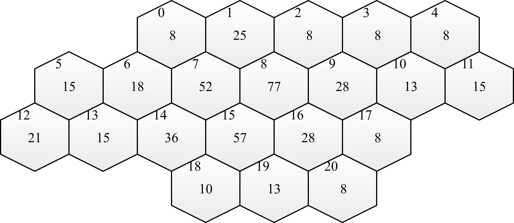
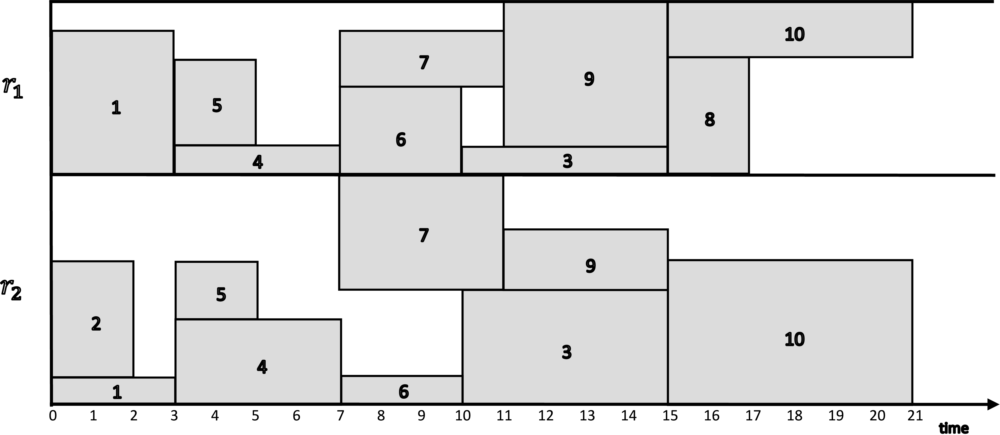
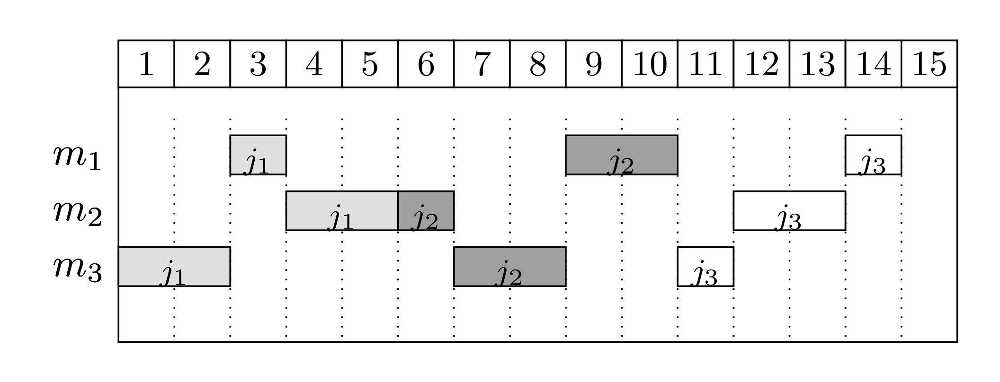
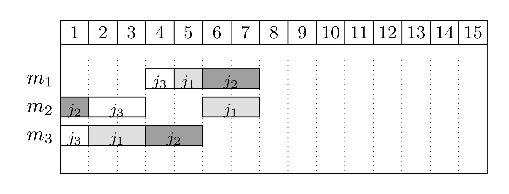

.. _chapExamples:

Modeling Examples
=================

This chapter includes commented examples on modeling and solving optimization
problems with Python-MIP.

The 0/1 Knapsack Problem
------------------------
 
As a first example, consider the solution of the 0/1 knapsack problem:
given a set :math:`I` of items, each one with a weight :math:`w_i`  and
estimated profit :math:`p_i`, one wants to select a subset with maximum
profit such that the summation of the weights of the selected items is
less or equal to the knapsack capacity :math:`c`.
Considering a set of decision binary variables :math:`x_i` that receive
value 1 if the :math:`i`-th item is selected, or 0 if not, the resulting
mathematical programming formulation is: 

.. math::
   
    \textrm{Maximize: }   &  \\
                                   &  \sum_{i \in I} p_i \cdot x_i  \\
    \textrm{Subject to: } & \\
                                   &  \sum_{i \in I} w_i \cdot x_i \leq c  \\
                                   &  x_i \in \{0,1\} \,\,\, \forall i \in I

The following python code creates, optimizes and prints the optimal solution for the
0/1 knapsack problem

.. code-block:: python
    :linenos:

    from mip.model import Model, xsum
    from mip.constants import MAXIMIZE, BINARY

    p = [10, 13, 18, 31, 7, 15]
    w = [11, 15, 20, 35, 10, 33]
    c = 47
    n = len(w)

    m = Model('knapsack', MAXIMIZE)

    x = [m.add_var(var_type=BINARY) for i in range(n)]

    m.objective = xsum(p[i]*x[i] for i in range(n))

    m += xsum(w[i]*x[i] for i in range(n)) <= c

    m.optimize()

    selected = [i for i in range(n) if x[i].x >= 0.99]
    print('selected items: {}'.format(selected))

Lines 1 and 2 import the required classes and definitions from Python-MIP.
Lines 4-7 define the problem data. Line 9 creates an empty maximization
problem :code:`m` with the (optional) name of "knapsack". Line 11 adds the
binary decision variables to model :code:`m`. Line 13 defines the
objective function of this model and line 15 adds the capacity constraint.
The model is optimized in line 17 and the solution, a list of the selected
items, is computed at line 19.

.. _tsp-label:

The Traveling Salesman Problem
------------------------------

The traveling salesman problem (TSP) is one of the most studied combinatorial
optimization problems, with the first computational studies dating back to the 50s :cite:`Dantz54,Appleg06`. 
To to illustrate this problem, consider that you
will spend some time in Belgium and wish to visit some of its main tourist
attractions, depicted in the map bellow:

.. image:: images/belgium-tourism-14.png
    :width: 60%
    :align: center

You want to find the shortest possible tour to visit all these places. More
formally, considering  :math:`n` points :math:`I=\{0,\ldots,n-1\}` and
a distance matrix :math:`D_{n \times n}` with elements :math:`d_{i,j} \in
\mathbb{R}^+`, a solution consists in a set of exactly :math:`n` (origin, 
destination) pairs indicating the itinerary of your trip, resulting in
the following formulation:

.. math::

    \textrm{Minimize: }   &  \\ 
    &  \sum_{i \in I, j \in I : i \neq j} d_{i,j} \ldotp x_{i,j} \\
    \textrm{Subject to: }   &  \\ 
    & \sum_{j \in I : i \neq j} x_{i,j} = 1 \,\,\, \forall i \in I  \\
    & \sum_{i \in I : i \neq j} x_{i,j} = 1 \,\,\, \forall j \in I \\
    & y_{i} -(n+1)\ldotp x_{i,j} \geq y_{j} -n  \,\,\, \forall i \in I\setminus \{0\}, j \in I\setminus \{0,i\}\\
    & x_{i,j} \in \{0,1\} \,\,\, \forall i \in J, j \in I\setminus \{j\} \\
    & y_i \geq 0 \,\,\, \forall i \in I

The first two sets of constraints enforce that we leave and arrive only
once at each point. The optimal solution for the problem including only
these constraints could result in a solution with sub-tours, such as the
one bellow.

.. image:: images/belgium-tourism-14-subtour.png 
    :width: 60%
    :align: center

To enforce the production of connected routes, additional variables
:math:`y_{i} \geq 0` are included in the model indicating the
sequential order of each point in the produced route. Point zero is
arbitrarily selected as the initial point and conditional constraints
linking variables :math:`x_{i,j},y_{i}` and :math:`y_{j}` ensure that the
selection of the arc :math:`x_{i,j}` implies that :math:`y_{j}\geq y_{i}+1`.

The Python code to create, optimize and print the optimal route for the TSP is
included bellow:

.. code-block:: python
    :linenos:

    from sys import argv
    from tspdata import TSPData
    from mip.model import Model, xsum
    from mip.constants import BINARY

    inst = TSPData(argv[1])
    (n, d) = (inst.n, inst.d)

    model = Model()

    x = [[model.add_var(var_type=BINARY) for j in range(n)] for i in range(n)]

    y = [model.add_var() for i in range(n)]

    model.objective = xsum(d[i][j]*x[i][j] for j in range(n) for i in range(n))

    for i in range(n):
        model += xsum(x[j][i] for j in range(n) if j != i) == 1
        model += xsum(x[i][j] for j in range(n) if j != i) == 1

    for i in range(1, n):
        for j in [x for x in range(1, n) if x != i]:
            model += y[i] - (n+1)*x[i][j] >= y[j] - n

    model.optimize(max_seconds=30)

    arcs = [(i, j) for i in range(n) for j in range(n) if x[i][j].x >= 0.99]
    print('optimal route : {}'.format(arcs))

This `example <https://raw.githubusercontent.com/coin-or/python-mip/master/examples/tsp-compact.py>`_ is included in the Python-MIP package in the example folder
Additional code to load the problem data (called from line 5) is included in `tspdata.py <https://raw.githubusercontent.com/coin-or/python-mip/master/examples/tspdata.py>`_. 
File `belgium-tourism-14.tsp <https://raw.githubusercontent.com/coin-or/python-mip/master/examples/belgium-tourism-14.tsp>`_ contains the coordinates
of the cities included in the example. To produce the optimal tourist tour for our Belgium example just enter:

.. code-block:: bash

    python tsp-compact.py belgium-tourism-14.tsp

In the command line. Follows an explanation of the tsp-compact code: line
11 creates the main binary decision variables for the selection of arcs
and line 13 creates the auxiliary continuous variables. Differently
from the :math:`x` variables, :math:`y` variables are not required to be
binary or integral, they can be declared just as continuous variables, the
default variable type. In this case, the parameter :code:`var_type` can be
omitted from the :code:`add_var` call. Line 15 sets the total traveled
distance as objective function and lines 17-23 include the constraints. In
line 25 we call the optimizer specifying a time limit of 30 seconds. This
will surely not be necessary for our Belgium example, which will be solved
instantly, but may be important for larger problems: even though high
quality solutions may be found very quickly by the MIP solver, the time
required to *prove* that the current solution is optimal may be very
large. With a time limit, the search is truncated and the best solution
found during the search is reported. Finally, the optimal solution for our
trip has length 547 and is depicted bellow:

.. image:: ./images/belgium-tourism-14-opt-547.png
    :width: 60%
    :align: center

n-Queens
--------

In the :math:`n`-queens puzzle :math:`n` chess queens should to be placed in a 
board with :math:`n\times n` cells in a way that no queen can attack another, 
i.e., there must be at most one queen per row, column and diagonal. This is a 
constraint satisfaction problem: any feasible solution is acceptable and no
objective function is defined. The following binary programming formulation 
can be used to solve this problem:

.. math::

    \sum_{j=1}^{n} x_{ij} & = 1 \,\,\, \forall i \in \{1, \ldots, n\}  \\
    \sum_{i=1}^{n} x_{ij} & = 1 \,\,\, \forall j \in \{1, \ldots, n\}  \\
    \sum_{i=1}^n \sum_{j=1 : i-j=k}^{n} x_{i,j} & \leq 1 \,\,\, \forall i \in \{1, \ldots, n\} ,  k \in \{2-n, \ldots, n-2\}  \\
    \sum_{i=1}^n \sum_{j=1 : i+j=k}^{n} x_{i,j} & \leq 1 \,\,\, \forall i \in \{1, \ldots, n\} ,  k \in \{3, \ldots, n+n-1\}  \\
    x_{i,j} & \in \{0, 1\} \,\,\, \forall i\in \{1, \ldots, n\}, j\in \{1, \ldots, n\}

The following code builds the previous model, solves it and prints the queen placements:

.. code-block:: python

    from sys import stdout
    from mip.model import Model, xsum
    from mip.constants import MAXIMIZE, BINARY

    n = 75

    queens = Model('queens', MAXIMIZE)

    x = [[queens.add_var('x({},{})'.format(i, j), var_type=BINARY)
          for j in range(n)] for i in range(n)]

    for i in range(n):
        queens += xsum(x[i][j] for j in range(n)) == 1, 'row({})'.format(i)

    for j in range(n):
        queens += xsum(x[i][j] for i in range(n)) == 1, 'col({})'.format(j)

    for p, k in enumerate(range(2 - n, n - 2 + 1)):
        queens += xsum(x[i][j] for i in range(n) for j in range(n)
                       if i - j == k) <= 1, 'diag1({})'.format(p)

    for p, k in enumerate(range(3, n + n)):
        queens += xsum(x[i][j] for i in range(n) for j in range(n)
                       if i + j == k) <= 1, 'diag2({})'.format(p)

    queens.optimize()

    stdout.write('\n')
    for i, v in enumerate(queens.vars):
        stdout.write('O ' if v.x >= 0.99 else '. ')
        if i % n == n-1:
        stdout.write('\n')

Frequency Assignment
--------------------

The design of wireless networks, such as cell phone networks, involves
assigning communication frequencies to devices. These communication frequencies
can be separated into channels. The geographical area covered by a network can
be divided into hexagonal cells, where each cell has a base station that covers
a given area. Each cell requires a different number of channels, based on usage
statistics and each cell has a set of neighbor cells, based on the geographical
distances. The design of an efficient mobile network involves selecting subsets
of channels for each cell, avoiding interference between calls in the same cell
and in neighboring cells.  Also, for economical reasons, the total bandwidth in
use must be minimized, i.e., the total number of different channels used. One
of the first real cases discussed in literature are the Philadelphia
:cite:`Ande73` instances, with the structure depicted bellow:

Each cell has a demand with the required number of channels drawn at the center
of the hexagon, and an identifier at the top left corner. Also, in this
example, each cell has a set of at most 6 adjacent neighboring cells (distance
1). The largest demand (77) occurs on cell 8. This cell has the following
adjacent cells, with distance 1: (1, 2, 7, 9, 15, 16) neighbors of the
neighbors have distance 2 and so on. The minimum distances between channels in
base stations with distances :math:`\{0, \ldots, 4\}`, in this example
instance, are :math:`[4, 2, 1, 1, 1]`, respectively, cells with distance 5 or
more do not interfere each other.  In this example each one of the 77 channels
allocated at cell 8 must be separated by at least 4 units and each of these
channels must be also at least two unities far from each channel assigned to
node 9, for example.

A generalization of this problem (not restricted to the hexagonal topology), is
the Bandwidth Multicoloring Problem (BMCP), which has the following input data:

:math:`N`:
    set of cells, numbered from 1 to :math:`n`;

:math:`r_i \in \mathbb{Z}^+`:
    demand of cell :math:`i \in N`, i.e., the required number of channels;

:math:`d_{i,j} \in \mathbb{Z}^+`:
    minimum distance between channels assigned to nodes :math:`i` and :math:`j`,
    :math:`d_{i,i}` indicates the minimum distance between different channels 
    allocated to the same cell.

Given an upper limit :math:`\overline{u}` on the maximum number of channels
:math:`U=\{1,\ldots,\overline{u}\}` used, which can be obtained using a simple
greedy heuristic, the BMPC can be formally stated as the combinatorial
optimization problem of defining subsets of channels :math:`C_1, \ldots, C_n`
while minimizing the used bandwidth and avoiding interference:

.. math::

     \textrm{Minimize:} & \\ 
                       & \max_{c \in C_1 \cup C_2, \ldots, C_n}c  \\
     \textrm{Subject to:} & \\
            \mid c_1 - c_2 \mid & \geq d_{i,j} \,\,\, \forall (i,j) \in N \times N, (c_1, c_2) \in C_i \times C_j \\
             C_i & \subseteq U \,\,\, \forall i \in N \\
             \mid C_i \mid &  = r_i \,\,\, \forall i \in N

This problem can be formulated as a mixed integer program with binary
variables indicating the composition of the subsets: binary variables
:math:`x_{(i,c)}` indicate if for a given cell :math:`i` channel :math:`c`
is selected (:math:`x_{(i,c)}=1`) or not (:math:`x_{(i,c)}=0`). The BMCP can
be modeled with the following MIP formulation:

.. math::

   \textrm{Minimize:} & \\      
                      & z \\
   \textrm{Subject to:} & \\      
        \sum_{c=1}^{\overline{u}} x_{(i,c)}  & = r_{i} \,\,\, \forall \, i \in N  \\
         z & \geq c\cdot x_{(i,c)} \,\,\, \forall \, i \in N, c \in U \\
        x_{(i,c)} + x_{(j,c')}   & \leq 1 \,\,\, \forall \, (i,j,c,c') \in N \times N \times U \times U : \, i \neq j \land \mid c-c' \mid < d_{(i,j)} \\
        x_{(i,c} + x_{(i,c')} & \leq 1 \,\,\, \forall i,c \in N \times U, c' \in \{c,+1\ldots, \min(c+d_{i,i}, \overline{u}) \} \\
         x_{(i,c)} & \in \{0, 1\} \,\,\, \forall \, i \in N, c \in U \\
          z  \geq 0

The following example creates this formulation and executes an heuristic to generate an
initial feasible solution and consequentily the set :math:`U`:

.. code-block:: python
    :linenos:

    from itertools import product
    import bmcp_data
    import bmcp_greedy
    from mip.model import Model, xsum
    from mip.constants import MINIMIZE, BINARY

    data = bmcp_data.read('P1.col')
    N, r, d = data.N, data.r, data.d
    S = bmcp_greedy.build(data)
    C, U = S.C, [i for i in range(S.u_max+1)]

    m = Model(sense=MINIMIZE)

    x = [[m.add_var('x({},{})'.format(i, c), var_type=BINARY)
          for c in U] for i in N]

    m.objective = z = m.add_var('z')

    for i in N:
        m += xsum(x[i][c] for c in U) == r[i]

    for i, j, c1, c2 in product(N, N, U, U):
        if i != j and c1 <= c2 < c1+d[i][j]:
            m += x[i][c1] + x[j][c2] <= 1

    for i, c1, c2 in product(N, U, U):
        if c1 < c2 < c1+d[i][i]:
            m += x[i][c1] + x[i][c2] <= 1

    for i, c in product(N, U):
        m += z >= (c+1)*x[i][c]

    m.start = [(x[i][c], 1.0) for i in N for c in C[i]]

    m.optimize(max_seconds=100)

    C = [[c for c in U if x[i][c] >= 0.99] for i in N]
    print(C)

Resource Constrained Project Scheduling
---------------------------------------

The Resource-Constrained Project Scheduling Problem (RCPSP) is a combinatorial
optimization problem that consists of finding a feasible scheduling for a set of
:math:`n` jobs subject to resource and precedence constraints. Each job has a
processing time, a set of successors jobs and a required amount of different 
resources. Resources are scarce but are renewable at each time period.
Precedence constraints between jobs mean that no jobs may start before all its
predecessors are completed. The jobs must be scheduled non-preemptively, i.e.,
once started, their processing cannot be interrupted.

The RCPSP has the following input data:

:math:`\mathcal{J}`
    jobs set

:math:`\mathcal{R}`
    renewable resources set

:math:`\mathcal{S}`
    set of precedences between jobs :math:`(i,j) \in \mathcal{J} \times \mathcal{J}`

:math:`\mathcal{T}`
    planning horizon: set of possible processing times for jobs

:math:`p_{j}`
    processing time of job :math:`j`

:math:`u_{(j,r)}`
    amount of resource :math:`r` required for processing job :math:`j`

:math:`c_r`
    capacity of renewable resource :math:`r`

In addition to the jobs that belong to the project, the set :math:`\mathcal{J}`
contains the jobs :math:`x_{0}` and :math:`x_{n+1}`. These jobs are dummy jobs and
represent the beginning of the planning and the end of the planning. The
processing time for the dummy jobs is zero and does not consume resources.

A binary programming formulation was proposed by Pritsker et al. :cite:`Prit69`. 
In this formulation, decision variables :math:`x_{jt} = 1` if job :math:`j` is assigned a completion
time at the end of time :math:`t`; otherwise, :math:`x_{jt} = 0`. All jobs must finish
in a single instant of time without violating the relationships of precedence
and amount of available resources. The model proposed by Pristker can be stated as 
follows:

.. math::

     \textrm{Minimize} & \\
     &  \sum_{t\in \mathcal{T}} (t-1).x_{(n+1,t)}\\
     \textrm{Subject to:} & \\
      \sum_{t\in \mathcal{T}} x_{(j,t)} & = 1  \,\,\, \forall j\in J \cup \{n+1\}\\
      \sum_{j\in J} \sum_{t'=t-p_{j}+1} u_{(j,r)}x_{(j,t')} & \leq c_{r}  \,\,\, \forall t\in \mathcal{T}, r \in R\\
      \sum_{t\in \mathcal{T}} t.x_{(s,t)} - \sum_{t \in \mathcal{T}} t.x_{(j,t)} & \geq p_{j}  \,\,\, \forall (j,s) \in S\\
     x_{(j,t)} & \in \{0,1\} \,\,\, \forall j\in J \cup \{n+1\}, t \in \mathcal{T}

An instance is shown below. The figure shows a graph where jobs :math:`\mathcal{J}`
are represented by nodes and precedence relations :math:`\mathcal{S}` are represented
by directed edges. Arc weights represent the time-consumption :math:`p_{j}`, while
the information about resource consumption :math:`u_{(j,r)}` is included next to the
graph. This instance contains 10 jobs and 2 renewable resources
(:math:`\mathcal{R}=\{r_{1}, r_{2}\}`), where :math:`c_{1}` = 6 and :math:`c_{2}` = 8. The
time horizon :math:`\mathcal{T}` can be estimated by summing the duration of all
jobs.

.. image:: ./images/rcpsp.png
    :width: 80%
    :align: center

The Python code for creating the binary programming model, optimize it and print the optimal scheduling
for RCPSP is included below:

.. code-block:: python

    from itertools import product
    from mip.model import Model, xsum
    from mip.constants import BINARY

    p = [0, 3, 2, 5, 4, 2, 3, 4, 2, 4, 6, 0]

    u = [[0, 0], [5, 1], [0, 4], [1, 4], [1, 3], [3, 2], [3, 1], [2, 4], [4, 0],
         [5, 2], [2, 5], [0, 0]]

    c = [6, 8]

    S = [[0, 1], [0, 2], [0, 3], [1, 4], [1, 5], [2, 9], [2, 10], [3, 8], [4, 6],
         [4, 7], [5, 9], [5, 10], [6, 8], [6, 9], [7, 8], [8, 11], [9, 11],
         [10, 11]]

    (R, J, T) = (range(len(c)), range(len(p)), range(sum(p)))

    model = Model()

    x = [[model.add_var(name='x({},{})'.format(j, t), var_type=BINARY)
          for t in T] for j in J]

    model.objective = xsum(x[len(J)-1][t] * t for t in T)

    for j in J:
        model += xsum(x[j][t] for t in T) == 1

    for (r, t) in product(R, T):
        model += xsum(u[j][r] * x[j][t2] for j in J
                      for t2 in range(max(0, t - p[j] + 1), t + 1)) <= c[r]

    for (j, s) in S:
        model += xsum(t * x[s][t] - t * x[j][t] for t in T) >= p[j]

    model.optimize()

    print('Makespan {}. Allocations: '.format(model.objective))
    for (j, t) in product(J, T):
        if x[j][t].x >= 0.99:
            print('({},{})'.format(j, t))

The optimal solution is shown bellow, from the viewpoint of resource
consumption:

Job Shop Scheduling Problem
---------------------------

The Job Shop Scheduling Problem (JSSP) is an NP-hard problem defined by a set
of jobs that must be executed by a set of machines in a specific order for each
job. Each job has a defined execution time for each machine and a defined
processing order of machines. Also, each job must use each machine only once.
The machines can only execute a job at a time and once started, the machine
cannot be interrupted until the completion of the assigned job. The objective
is to minimize the makespan, i.e. the maximum completion time among all jobs.

For instance, suppose we have 3 machines and 3 jobs. The processing order for
each job is as follows (the processing time of each job in each machine is
between parenthesis):

- Job :math:`j_1`: :math:`m_3` (2) :math:`\rightarrow` :math:`m_1` (1) :math:`\rightarrow` :math:`m_2` (2)
- Job :math:`j_2`: :math:`m_2` (1) :math:`\rightarrow` :math:`m_3` (2) :math:`\rightarrow` :math:`m_1` (2)
- Job :math:`j_3`: :math:`m_3` (1) :math:`\rightarrow` :math:`m_2` (2) :math:`\rightarrow` :math:`m_1` (1)

Bellow there are two feasible schedules:

The first schedule shows a naive solution: jobs are processed in a sequence and 
machines stay idle quite often. The second solution is the optimal one, where jobs
execute in parallel.

The JSSP has the following input data:

:math:`\mathcal{J}`
    set of jobs, :math:`\mathcal{J} = \{1,...,n\}`,

:math:`\mathcal{M}`
    set of machines, :math:`\mathcal{M} = \{1,...,m\}`,

:math:`o^j_r`
    the machine that processes the :math:`r`-th operation of job :math:`j`, the sequence 
    without repetition :math:`O^j = (o^j_1,o^j_2,...,o^j_m)` is the processing order of :math:`j`,

:math:`p_{ij}`
    non-negative integer processing time of job :math:`j` in machine :math:`i`.

A JSSP solution must respect the following constraints:

- All jobs :math:`j` must be executed following the sequence of machines given by :math:`O^j`,
- Each machine can process only one job at a time,
- Once a machine starts a job, it must be completed without interruptions.

The objective is to minimize the makespan, the end of the last job to be
executed. The JSSP is NP-hard for any fixed :math:`n \ge 3` and also for any
fixed :math:`m \ge 3`.

The decision variables are defined by:

:math:`x_{ij}`
    starting time of job :math:`j \in J` on machine :math:`i \in M`

:math:`y_{ijk}=` 
    :math:`\begin{cases} 1, & \text{if job } j \text{ precedes job } k \text{ on machine } i \text{,}\\ & i \in \mathcal{M} \text{, } j, k  \in \mathcal{J} \text{, } j \neq k \\ 0, & \text{otherwise} \end{cases}`

:math:`C` 
    variable for the makespan 

Follows a MIP formulation for the JSSP. The objective function is computed
in the auxiliary variable :math:`C`. The first set of constraints are the
precedence constraints, that ensure that a job on a machine only starts
after the processing of the previous machine concluded. The second and 
third set of disjunctive constraints ensure that only one job is processing
at a given time in a given machine. The :math:`M` constant must be large enough to 
ensure the correctness of these constraints. A valid (but weak) estimate for this
value can be the summation of all processing times. The fourth set of constrains 
ensure that the makespan value is computed correctly and the last constraints indicate
variable domains.

.. math:: 

    \textrm{min: }  &  \\
                   & C \\
    \textrm{s.t.: } &  \\
                   x_{o^{j}_{r}j} &  \geq x_{o^{j}_{r-1}j} +p_{o^{j}_{r-1}j} \,\,\, \forall r \in \{2,..,m\}, j \in \mathcal{J} \\
                       x_{ij}     & \geq x_{ik} + p_{ik} - M \cdot y_{ijk} \,\,\, \forall j,k \in \mathcal{J}, j \neq k, i \in \mathcal{M} \\
                       x_{ik}     & \geq x_{ij} + p_{ij} - M \cdot (1-y_{ijk}) \,\,\, \forall j,k \in \mathcal{J}, j \neq k,i \in \mathcal{M} \\
                       C          & \geq x_{o^{j}_{m}j} + p_{o^{j}_{m}j} \,\,\, \forall j \in \mathcal{J} \\
                      x_{ij}      & \geq 0 \,\,\, \forall i \in \mathcal{J}, i \in \mathcal{M} \\
                      y_{ijk}     & \in \{0,1\} \,\,\, \forall j,k \in \mathcal{J}, i \in \mathcal{M} \\
                      C & \geq 0

The following Python-MIP code optimizes creates the previous formulation, optimizes it and print
the optimal solution found:

.. code-block:: python

    from itertools import product
    from sys import argv
    from jssp_instance import JSSPInstance
    from mip.model import Model
    from mip.constants import BINARY

    inst = JSSPInstance(argv[1])
    n, m, machines, times, M = inst.n, inst.m, inst.machines, inst.times, inst.M

    model = Model('JSSP')

    c = model.add_var(name="C")
    x = [[model.add_var(name='x({},{})'.format(j+1, i+1))
          for i in range(m)] for j in range(n)]
    y = [[[model.add_var(var_type=BINARY, name='y({},{},{})'.format(j+1, k+1, i+1))
           for i in range(m)] for k in range(n)] for j in range(n)]

    model.objective = c

    for (j, i) in product(range(n), range(1, m)):
        model += x[j][machines[j][i]] - x[j][machines[j][i-1]] >= \
            times[j][machines[j][i-1]]

    for (j, k) in product(range(n), range(n)):
        if k != j:
            for i in range(m):
                model += x[j][i] - x[k][i] + M*y[j][k][i] >= times[k][i]
                model += -x[j][i] + x[k][i] - M*y[j][k][i] >= times[j][i] - M

    for j in range(n):
        model += c - x[j][machines[j][m - 1]] >= times[j][machines[j][m - 1]]

    model.optimize()

    print("C: ", c.x)
    for j in range(n):
        for i in range(m):
            print('x({},{}) = {} '.format(j+1, i+1, x[j][i].x), end='')
    print()

