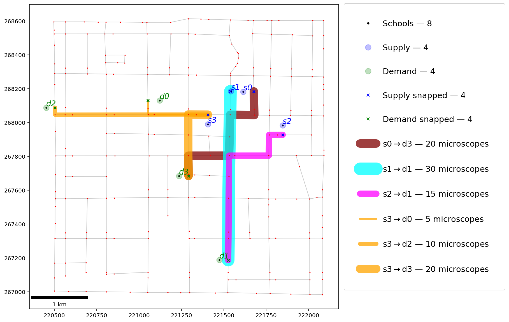
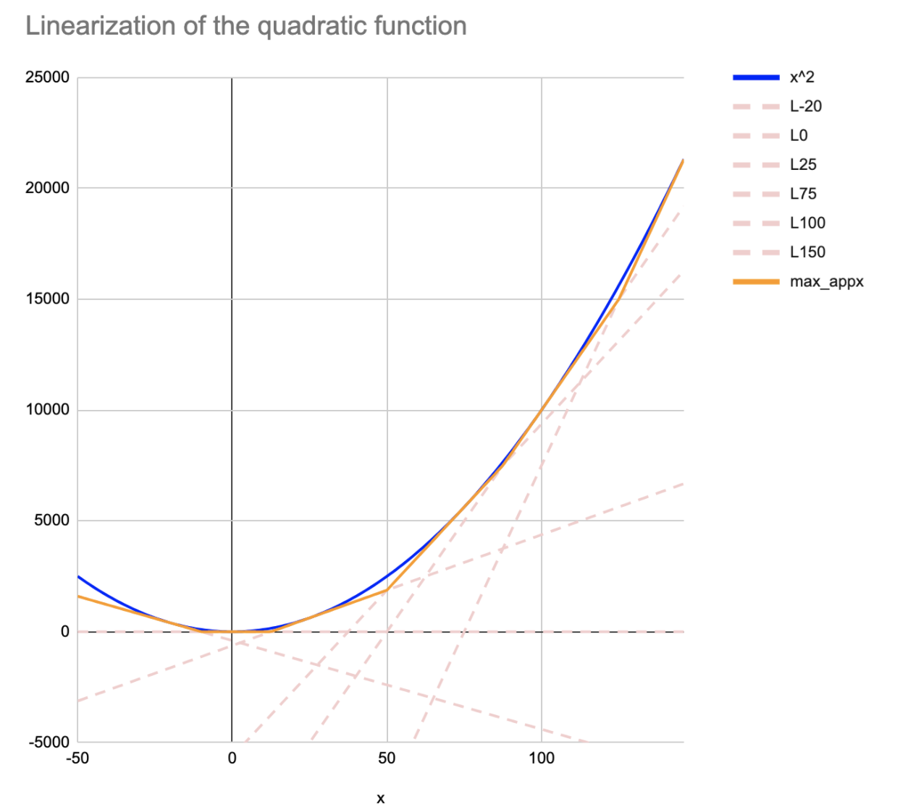

.. _chapExternal:

External Documentation/Examples
===============================

This section includes links for external documentation and examples. Some
documents provide information on how to integrate Python-MIP with
other Python tools.

- `Network-constrained Transportation Problem. <https://pysal.org/spaghetti/notebooks/transportation-problem.html>`_: provides a notebook for solving a transportation problem and integrating with `Pysal <http://pysal.org>`_, by James D. Gaboardi.

- `How to choose stocks to invest in with Python <https://towardsdatascience.com/choose-stocks-to-invest-with-python-584892e3ad22>`_, by Khuyen Tran, includes an example of building an optimal multi-year investment plan in Python-MIP.

- `Solving a Quadratic Problem <https://github.com/pabloazurduy/qp-mip>`_, by `pabloazurduy <https://github.com/pabloazurduy>`_.

- `Formulation for the Vehicle Routing Problem with Time Windows (VRPTW) <https://github.com/Bang2018/VRPTW>`__, by Krishnendu Mukherjee, includes a model for the VRPTW coded in Python-MIP.
